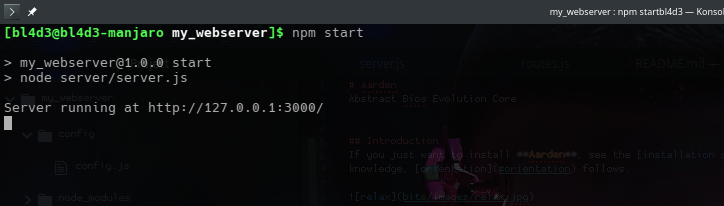

# My Web Server

This is a basic web server created with Node.js without using any framework.

## Project Structure

| Path                | Description                        |
|---------------------|------------------------------------|
| `my-webserver/`     | Root project directory            |
| ├── `server/`       | Directory for server files        |
| │ ├── `server.js`    | Main server file                  |
| │ └── `routes.js`   | Separate routes logic             |
| ├── `config/`       | Directory for configuration files |
| │ └── `config.js`   | Configuration settings            |
| ├── `package.json`  | Project metadata and dependencies |
| └── `README.md`     | Project documentation             |

## Usage

1. Clone the repository.
2. Run `npm install` to set up the project.
3. Run `npm start` to start the server.
4. Visit `http://127.0.0.1:3000/` for the home page, or `http://127.0.0.1:3000/about` for the about page.

## Starting the servers

Once the files are set up, you can start the server with:

```bash
npm start
```


